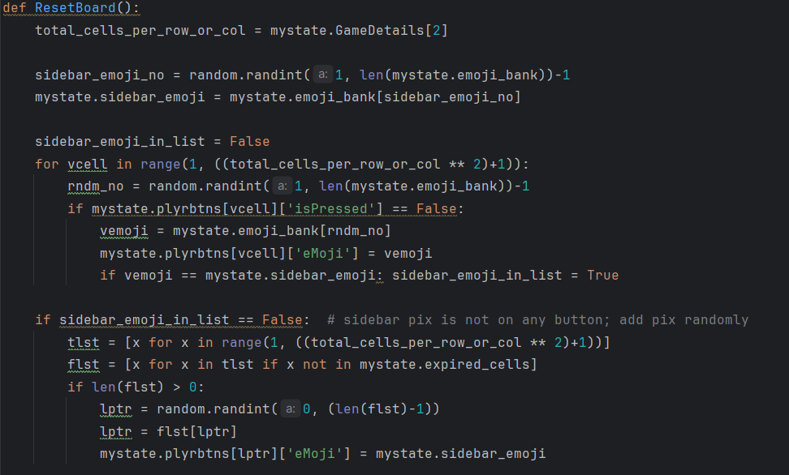

# Requistos vs código
## Requisitos Funcionales y Criterios de Aceptación

| Requisito y Criterios de Aceptación                                                                                                                                                                                                                                                                                                                                                                                                                                                                                                                                      | Código/Imagen                                            |
|--------------------------------------------------------------------------------------------------------------------------------------------------------------------------------------------------------------------------------------------------------------------------------------------------------------------------------------------------------------------------------------------------------------------------------------------------------------------------------------------------------------------------------------------------------------------------|----------------------------------------------------------|
| **1. Configuración de Nivel de Dificultad** **Requisito:** El sistema debe permitir a los jugadores seleccionar el nivel de dificultad antes de comenzar el juego. **Criterios de Aceptación:** - Opciones de dificultad fácil, medio y difícil disponibles para selección. - La configuración de dificultad debe influir en la mecánica del juego, como la frecuencia de regeneración de imágenes y la puntuación. - Tiempos de regeneración específicos:   - Fácil: cada 8 segundos.   - Medio: cada 6 segundos.   - Difícil: cada 5 segundos. |                                   |
| **2. Inicialización del Tablero** **Requisito:** Al comenzar un juego, el sistema debe inicializar el tablero con un conjunto aleatorio de imágenes basado en la dificultad seleccionada. **Criterios de Aceptación:** - El tablero debe ser llenado con imágenes de emojis que corresponden a la dificultad elegida. - Ninguna imagen objetivo (emoji de la barra lateral) debe aparecer más de una vez en el tablero inicial. - La imagen objetivo debe ser seleccionada aleatoriamente y mostrada en la barra lateral.                                 |    |
| **3. Parametrización del Nombre del Jugador y País** **Requisito:** El sistema debe permitir a los jugadores ingresar su nombre y país antes de comenzar el juego. **Criterios de Aceptación:** - Debe existir un campo de texto para que los jugadores ingresen su nombre y país. - Es posible que los campos de nombre y país estén vacíos, pero en ese caso no se muestra el _Leaderboard_ - La información del jugador debe persistir durante la sesión de juego.                                                                                     | `Código para ingresar nombre y país`                     |
| **4. Interacción del Usuario con la Interfaz *Requisito: Los jugadores deben poder interactuar con la interfaz del juego para seleccionar emojis coincidentes. *Criterios de Aceptación: - Los emojis deben ser seleccionables mediante botones en la cuadrícula. - Cada botón solo puede ser presionado una vez por juego. - La selección correcta e incorrecta de emojis tiene efectos diferentes en la puntuación.                                                                                                                                     |                               |
| **5. Visualización de Puntuación y Estado del Juego *Requisito: El sistema debe mostrar la puntuación actual y el estado del juego en tiempo real. *Criterios de Aceptación: - Mostrar la puntuación actual y emojis indicativos del rendimiento. - Indicar cuántos emojis quedan por ser seleccionados. - Actualizar la interfaz para reflejar el estado correcto o incorrecto después de cada selección.                                                                                                                                                |    |
| **6. Regeneración y Aleatoriedad de Emojis *Requisito: Los emojis en la interfaz de juego deben regenerarse regularmente, introduciendo nuevos emojis aleatorios. *Criterios de Aceptación: - La barra lateral y los emojis de la cuadrícula deben actualizarse en el intervalo de tiempo establecido por el nivel de dificultad. - Asegurar que el emoji de la barra lateral esté presente al menos una vez en la cuadrícula.                                                                                                                               |    |
| **7. Gestión del Tablero de Líderes *Requisito: El sistema debe ofrecer una función de tablero de líderes que registre los puntajes más altos. *Criterios de Aceptación: - Permitir la entrada del nombre del jugador para incluir en el tablero de líderes. - Registrar y mostrar los tres mejores puntajes. - Ordenar y mantener actualizado el tablero de líderes basado en los puntajes más altos.                                                                                                                                                    |    |

