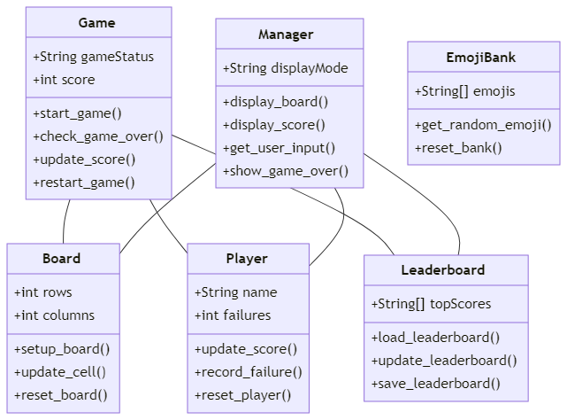
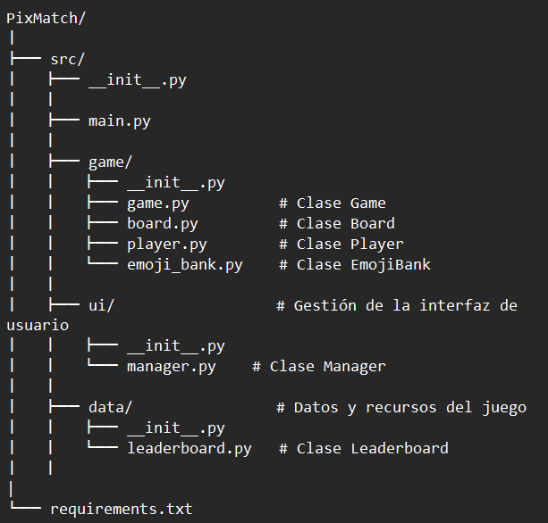

## Ayudas
A continuación verás algunos textos y preguntas que pueden ayudar en el proceso de identificación de las clases, métodos, atributos y relaciones para 
refactorizar el código del ejercicio

### Identificación de Clases Potenciales
Para identificar las clases, piensa en los "nombres sustantivos" que ves en la descripción del proyecto y en las funcionalidades que has observado:
- **Entidades Principales:** ¿Qué sustantivos se mencionan repetidamente? Ejemplo: en un juego, clases como `Jugador`, `Tablero`, `Juego` podrían ser centrales.
- **Grupos de Datos:** ¿Qué información se maneja conjuntamente? Esto podría indicar una clase. Por ejemplo, si se maneja nombre, puntaje, y nivel del jugador, una clase `Jugador` podría encapsular estos datos.
- **Agrupación lógica de funcionalidades**: Si partes del código siempre operan juntas o manejan la misma categoría de datos, probablemente deberían ser una clase. 
 - **Objetos y colecciones**
   - **Arreglos con Posiciones Específicas**
     - Si encuentras arreglos donde cada posición tiene un significado específico (por ejemplo, `datos[0]` siempre es el nombre, `datos[1]` es la dirección, etc.), es un indicativo claro de que esos datos podrían estar mejor representados como atributos de una clase. Acceder a los datos sería más legible y menos propenso a errores usando `objeto.nombre` y `objeto.direccion` en lugar de índices numéricos.

   - **Listas de Tuplas para Representar Objetos**
     - A menudo se utilizan listas de tuplas para representar una colección de objetos. Cada tupla contiene varios elementos relacionados, como por ejemplo, `(nombre, edad, salario)`. Este es un buen candidato para convertirse en una clase `Empleado`, donde cada instancia representa un empleado específico.

   - **Datos Agrupados que se Pasan Juntos**
     - Si pasas grupos de variables juntos a múltiples funciones, esto puede indicar que esos datos están estrechamente relacionados y serían más efectivos como una clase. Por ejemplo, si pasas información sobre un libro como título, autor y año a varias funciones, considera agruparlos en una clase `Libro`.
  
   - **Lógica Compleja que Manipula los Arreglos**
     - Si el código incluye manipulaciones complejas o repetidas de datos almacenados en arreglos o listas, encapsular esta lógica en métodos de una clase puede hacer el código más organizado, reusable y fácil de mantener.
   - **Extensión y Mantenimiento**
     - Si anticipas que los datos o las estructuras podrían expandirse en el futuro, usar clases hace que sea mucho más fácil añadir estas nuevas características sin perturbar el resto del sistema.

### Identificación de Métodos
Los métodos son acciones que las clases pueden realizar. Para definir métodos, busca "verbos" asociados con los sustantivos identificados:
- **Acciones Específicas:** ¿Qué acciones realiza cada entidad principal? Por ejemplo, un `Jugador` podría `incrementar_puntaje()`, `actualizar_nivel()`.
- **Funcionalidades del Sistema:** ¿Qué procesos y operaciones importantes necesita realizar el sistema? Ejemplo: `iniciar_juego()`, `verificar_seleccion()` en la clase `Juego`.
- Observa las tareas que se repiten en diferentes partes del código y que podrían ser centralizadas en un método de una clase
- **Funciones que operan sobre los mismos datos**: Cualquier función que modifique o utilice los mismos datos repetidamente es un candidato para ser un método de una clase. Por ejemplo, las funciones que modifican o leen el estado del juego (reset_board, update_score, check_game_end) podrían ser métodos de una clase Game.
- **Reutilización de código**: Si el mismo bloque de código se utiliza en múltiples funciones, considera convertirlo en un método dentro de una clase para mejorar la reutilización y la claridad

### Identificación de Atributos y Modificadores de Acceso
Los atributos son las características o propiedades de las clases, y los modificadores de acceso definen cómo se puede acceder a estos atributos:
- **Atributos:** Identifica qué información es fundamental para cada clase. Por ejemplo, la clase `Jugador` podría tener atributos como `nombre`, `puntaje`. 
- ¿Cuáles son los datos requeridos al momento de crear un objeto? estos a menudo se convierten en atributos de clase.
- **Modificadores de Acceso:** Decide quién necesita acceder a estos atributos. Utiliza `private` (privado) si solo la propia clase debe acceder a ellos. ¿Existen datos sensibles o críticos que deben ser protegidos de cambios externos?
- Variables compartidas entre funciones: Si varias funciones leen o modifican las mismas variables, esas variables son buenos candidatos para ser atributos de una clase. 
- Datos que definen el estado de un objeto: Cualquier dato que capture información sobre el estado de un sistema o de una entidad dentro de tu aplicación probablemente debería ser un atributo de una clase. Esto incluye configuraciones, contadores como puntajes o tiempos, y estados como el estado actual del juego.

#  Entregable - Mejoras para pasar a POO
Detalla en este markdown lo siguiente: 
- **Clases a Definir:** Enumera las clases que se podrían definir, describe sus propósito y justifica porque crees que es una clase útil para mejorar el programa. 
R// Las clases que se podrian definir para el juego pixmatch, podrian ser:  
- Clase Game 
--Responsabilidades: Manejar la lógica del flujo del juego, incluyendo el inicio y el reinicio de partidas, la comprobación de las condiciones de victoria y derrota, y la gestión del estado del juego (como el puntaje y los errores). 
--Por qué es útil: Esta clase sería el núcleo del juego, coordinando cómo interactúan todas las otras partes del juego.
- Clase Board 
--Responsabilidades: Representar el tablero de juego y mantener el estado de las celdas (si han sido presionadas, qué emoji contienen).
 --Por qué es útil: Permite encapsular toda la lógica relacionada con el tablero en un solo lugar, facilitando la modificación de la representación del tablero sin afectar otras partes del código.
- Clase Player 
--Responsabilidades: Mantener la información del jugador, como el nombre, la puntuación actual, y el número de fallos.
 --Por qué es útil: Desacopla la información del jugador de la lógica del juego, facilitando, por ejemplo, la expansión a múltiples jugadores o la conservación de datos del jugador entre sesiones.
- Clase Leaderboard  
--Responsabilidades: Gestionar la tabla de líderes, incluyendo la carga, actualización y almacenamiento.
 --Por qué es útil: Centraliza la gestión de la tabla de líderes, haciendo el código más limpio y organizado, y facilitando la reutilización en diferentes partes del juego o incluso en otros juegos.
- Clase Manager 
--Responsabilidades: Encargarse de toda la interacción con la interfaz de usuario de Streamlit, como mostrar botones, imágenes, y recoger la entrada del usuario.
 --Por qué es útil: Separa la lógica de la interfaz de usuario del resto de la lógica del juego, lo cual es especialmente útil para pruebas y si alguna vez decides cambiar de tecnología de interfaz de usuario.
- Clase EmojiBank 
--Responsabilidades: Administrar el banco de emojis utilizados en el juego, incluyendo la selección aleatoria de emojis para el tablero y la barra lateral.
 --Por qué es útil: Encapsula todo lo relacionado con la selección y manejo de emojis, facilitando cambios en la selección de emojis sin afectar otras partes del código.
- **Métodos Importantes:** Enumera los métodos principales para cada clase. Incluye una descripción de cuál sería la utilidad de cada método
  R// Algunos metodos de las clases definidas podrian ser: 
- Clase Game:  start_game(): Inicia una nueva partida, estableciendo el estado inicial del juego y preparando el tablero. 
check_game_over(): Comprueba si se han cumplido las condiciones de victoria o derrota, como alcanzar el límite de fallos. 
update_score(): Actualiza la puntuación del jugador basada en sus acciones durante el juego. 
restart_game(): Reinicia el juego a su estado inicial para comenzar de nuevo. 
- Clase Board: 
setup_board(): Inicializa el tablero con emojis aleatorios de EmojiBank. 
update_cell(): Actualiza el estado de una celda específica cuando el jugador hace una selección. 
reset_board(): Limpia el tablero para una nueva partida o reinicio.
- Clase Player: 
update_score(): Modifica la puntuación del jugador. 
record_failure(): Incrementa el contador de fallos del jugador. 
reset_player(): Restablece los datos del jugador para una nueva partida. 
- Clase Leaderboard: 
load_leaderboard(): Carga la tabla de líderes desde un archivo. 
update_leaderboard(): Actualiza la tabla de líderes con la nueva puntuación del jugador. 
save_leaderboard(): Guarda los cambios en la tabla de líderes en el archivo. 
- Clase Manager:  
display_board(): Muestra el tablero de juego en la interfaz de usuario. 
display_score(): Muestra la puntuación actual del jugador. 
get_user_input(): Recoge la entrada del usuario en la interfaz. 
show_game_over(): Muestra un mensaje de fin de juego y opciones de reinicio. 
- Clase EmojiBank: 
get_random_emoji(): Retorna un emoji aleatorio para usar en el tablero. 
reset_bank(): Reinicia el banco de emojis si es necesario. 
- **Imagen del UML del diagrama de clases**  Adjunta una imagen del UML del diagrama de clases como una forma visual de planificar y entender la estructura de las clases, métodos, atributos y relaciones que podría tener una versión mejorada del código fuente.

- **Organización de archivos:** Propon una estructura de organización de los archivos de este proyecto para que no queden todos en la raiz principal. Investiga cuáles podrían ser buenas formas de organizar los directorios y a partir de tu investigación indica qué directorios crearías y cómo los organizarías.

